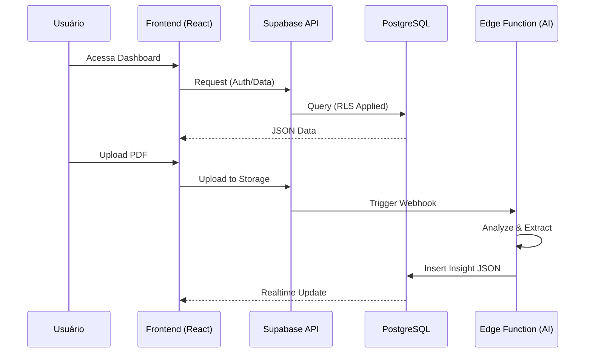

# Documentação do Agente Jurídico

**Última Atualização:** 2026-02-06

Este documento fornece uma visão geral técnica e funcional do sistema Agente Jurídico, detalhando a estrutura de navegação, as funcionalidades principais e o fluxo de dados.

## 1. Estrutura do Sistema (Abas e Funcionalidades)

O sistema é composto por uma interface web moderna (React) organizada em um menu lateral fixo (Sidebar). Abaixo estão descritas as principais telas:

### **Dashboard (`/dashboard`)**
- **Objetivo:** Visão geral estratégica do escritório.
- **Funcionalidades Típicas:** Resumo de processos ativos, próximos prazos urgentes, estatísticas de produtividade e atalhos rápidos.

### **Processos (`/processos`)**
- **Objetivo:** Gestão centralizada dos casos jurídicos.
- **Funcionalidades:** 
  - Listagem de processos com filtros.
  - Detalhes do processo (partes, número, status).
  - Acompanhamento de andamentos.

### **Prazos (`/prazos`)**
- **Objetivo:** Controle rigoroso de datas fatais.
- **Funcionalidades:** 
  - Lista cronológica de obrigações.
  - Indicadores de urgência (cores/ícones).
  - Checkbox para conclusão de tarefas.

### **Calendário (`/calendario`)**
- **Objetivo:** Visualização temporal da agenda.
- **Funcionalidades:** 
  - Visão mensal/semanal de prazos e audiências.
  - Integração visual com os prazos cadastrados.

### **Alertas (`/alertas`)**
- **Objetivo:** Central de notificações.
- **Funcionalidades:** 
  - Avisos sobre publicações novas.
  - Lembretes de prazos próximos.
  - Notificações de sistema.

### **Documentos (`/documentos`)**
- **Objetivo:** Gestão documental (GED).
- **Funcionalidades:** 
  - Upload e armazenamento de peças e anexos.
  - Organização por pastas ou tags.

### **Configurações (`/configuracoes`)**
- **Objetivo:** Ajustes do sistema e preferências do usuário.
- **Funcionalidades:** 
  - Configuração de perfil.
  - Preferências de notificação.
  - Temas (Claro/Escuro).

---

## 2. Arquitetura e Fluxo de Dados

O sistema opera em uma arquitetura **Serverless / Event-Driven**, utilizando **React (Vite)** no frontend e **Supabase** como backend completo (Database, Auth, Storage, Edge Functions).

### **Fluxo de Autenticação e Dados**

1.  **Cliente (Frontend):**
    - Aplicação React hospedada (Vite).
    - Comunica-se diretamente com o Supabase via SDK (`@supabase/supabase-js`).

2.  **Camada de Dados (Supabase):**
    - **PostgreSQL**: Banco de dados relacional com tabelas em `snake_case`.
    - **RLS (Row Level Security)**: Garante que cada usuário só acesse seus próprios dados (`user_id = auth.uid()`).

3.  **Processamento de IA (Edge Functions):**
    - Ao fazer upload de um documento, um **Database Webhook** aciona uma função Deno.
    - A função processa o PDF, chama o LLM (Llama 3) e salva o resultado JSON no banco.

### **Diagrama Lógico Simplificado**

---

## 3. Próximos Passos Sugeridos

Com a infraestrutura base (Database + AI) estabelecida, os próximos passos focam na experiência do usuário e refinamento da IA:

1.  **Interface de Feedback:** Componente visual para exibir o JSON da IA de forma amigável (Cards de Urgência).
2.  **Chat com Documento (RAG):** Permitir perguntas diretas ao PDF ("Qual o valor da causa?").
3.  **Refinamento de Prompt:** Melhorar a precisão para casos específicos (Trabalhista vs Cível).

---
**Autor:** Equipe de Desenvolvimento Agente Jurídico
**Data:** Fevereiro 2026
