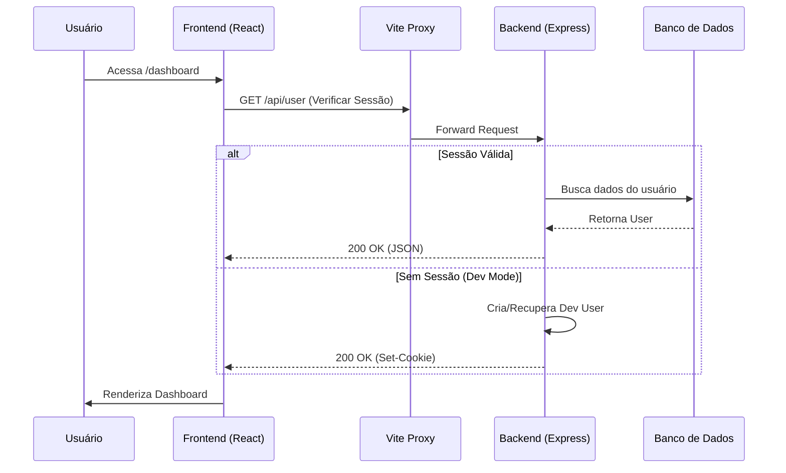

# Documentação do Agente Jurídico

Este documento fornece uma visão geral técnica e funcional do sistema Agente Jurídico, detalhando a estrutura de navegação, as funcionalidades principais e o fluxo de dados.

## 1. Estrutura do Sistema (Abas e Funcionalidades)

O sistema é composto por uma interface web moderna (React) organizada em um menu lateral fixo (Sidebar). Abaixo estão descritas as principais telas:

### **Dashboard (`/dashboard`)**
- **Objetivo:** Visão geral estratégica do escritório.
- **Funcionalidades Típicas:** Resumo de processos ativos, próximos prazos urgentes, estatísticas de produtividade e atalhos rápidos.

### **Processos (`/processos`)**
- **Objetivo:** Gestão centralizada dos casos jurídicos.
- **Funcionalidades:** 
  - Listagem de processos com filtros.
  - Detalhes do processo (partes, número, status).
  - Acompanhamento de andamentos.

### **Prazos (`/prazos`)**
- **Objetivo:** Controle rigoroso de datas fatais.
- **Funcionalidades:** 
  - Lista cronológica de obrigações.
  - Indicadores de urgência (cores/ícones).
  - Checkbox para conclusão de tarefas.

### **Calendário (`/calendario`)**
- **Objetivo:** Visualização temporal da agenda.
- **Funcionalidades:** 
  - Visão mensal/semanal de prazos e audiências.
  - Integração visual com os prazos cadastrados.

### **Alertas (`/alertas`)**
- **Objetivo:** Central de notificações.
- **Funcionalidades:** 
  - Avisos sobre publicações novas.
  - Lembretes de prazos próximos.
  - Notificações de sistema.

### **Documentos (`/documentos`)**
- **Objetivo:** Gestão documental (GED).
- **Funcionalidades:** 
  - Upload e armazenamento de peças e anexos.
  - Organização por pastas ou tags.

### **Configurações (`/configuracoes`)**
- **Objetivo:** Ajustes do sistema e preferências do usuário.
- **Funcionalidades:** 
  - Configuração de perfil.
  - Preferências de notificação.
  - Temas (Claro/Escuro).

---

## 2. Diagrama de Requisição e Arquitetura

O sistema opera em uma arquitetura Cliente-Servidor desacoplada, utilizando **React (Vite)** no frontend e **Express (Node.js)** no backend.

### **Fluxo de Autenticação e Dados**

1.  **Cliente (Frontend):**
    - O usuário acessa a aplicação via navegador.
    - Em ambiente de desenvolvimento, o Vite atua como servidor de arquivos estáticos e proxy.

2.  **Requisição API (`/api/*`):**
    - Todas as chamadas de dados são prefixadas com `/api`.
    - O proxy (configurado no `vite.config.ts`) encaminha essas requisições para o servidor Express na porta 3000.

3.  **Middleware de Autenticação (`sdk.ts`):**
    - Ao receber uma requisição, o servidor verifica o cookie de sessão (`agente-jur-session`).
    - **Modo Desenvolvimento:** Se não houver sessão válida, o sistema cria automaticamente um "Usuário Dev" e autentica a requisição, permitindo fluxo contínuo sem login externo.
    - **Modo Produção:** Exige um token de sessão válido validado contra o banco de dados.

4.  **Processamento e Resposta:**
    - O servidor processa a regra de negócio (banco de dados, lógica jurídica).
    - Retorna uma resposta JSON para o frontend.

### **Diagrama Lógico Simplificado**

---

## 3. Próximos Passos Sugeridos

Com a base limpa e o sistema de autenticação próprio estabelecido, os próximos passos recomendados para a evolução do trabalho são:

1.  **Refinamento do Dashboard:** Implementar widgets reais conectados aos dados do banco.
2.  **Módulo de Processos:** Criar o CRUD completo de processos (Create, Read, Update, Delete).
3.  **Sistema de Notificações:** Implementar lógica real de alertas baseada nas datas dos prazos.
4.  **Testes de Integração:** Expandir a cobertura de testes para garantir a estabilidade das novas rotas de API.

---
**Autor:** Equipe de Desenvolvimento Agente Jurídico
**Data:** Fevereiro 2026
